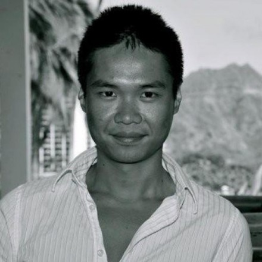

# Humanity of Ruby

Ruby code is highly readable and flexible, Ruby community is highly open and helpful: these are the facts most Ruby developers agree and sometimes take for granted. When I just joined Groupon and was challenged to gain both domain and technical knowledge at fast pace, Ruby allowed me to quickly learn what is essential for company's business and contribute to its long-term growth.

"No man is an island". As a Ruby developer, I entered the Ruby community but soon the community entered me. I was inspired by the openness of the community and teamed up with other Groupon engineers attempting to improve Chicago Public Schools. As inequality gap increases in our society, how can we inspire and teach the unpriviledged, and provide them the tools to change their own future?

In this talk, I'll share:
  - My development experience at Groupon: how Ruby helps me understand domain logic quickly and why it is important.
  - My teaching experience at Chicago Public School: how my co-workers and I try to inspire middle school students using technology to unlock their potential.

## Marshall Shen
A native Chinese born, Marshall Shen started out his U.S adventure by studying at the University of Iowa. He is now a software developer at Groupon, where he spends time implementing and supporting various Ruby applications. He's a core contributor of [Jekyllbootstrap](http://jekyllbootstrap.com/), a citizen teacher at [Citizen School](http://www.citizenschools.org/), and co-organizer of [2013 Learn Startup Machine at Chicago](https://www.leanstartupmachine.com/workshops/chicago-september-20-22).

Marshall enjoys living in the Windy City and maintains a full list of "must-try" Chicago restaurants. If you ever wonder what to eat in Chicago, feel free to ask him!

- [My website](http://marshallshen.github.io)
- [My twitter](https://twitter.com/marshallshen)
- [Past talk slides](https://github.com/marshallshen/speaking/tree/master/rethink-application-design)
